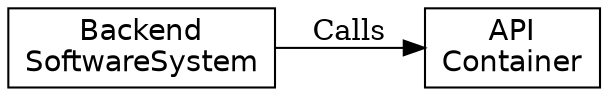

# Алгоритм: JSON → DOT (json2dot.py)

Скрипт `scripts/json2dot.py` конвертирует результат парсеров (JSON вида `{components, requests, parent_child, success}`) в DOT-граф для Graphviz (`dot`, `neato` и др.).

## Использование

```bash
python3 scripts/json2dot.py < input.json          # из stdin
python3 scripts/json2dot.py input.json            # из файла
python3 scripts/json2dot.py input.json -o out.dot # в файл
```

Если вход содержит `"success": false`, в stderr выводится предупреждение.

## Правила конвертации

1. **Заголовок:** `digraph G { rankdir=LR; node [shape=box, fontname="Helvetica"]; }` — направление слева направо.
2. **Узлы** — из `components[]`:
   - DOT-id — `id` (цитируется, если не является `[a-zA-Z_][a-zA-Z0-9_]*`);
   - подпись — `name`, с добавлением `\n{c4_type}` если поле есть.
3. **Рёбра** — из `requests[]`:
   - `component_source_id -> component_target_id`, подпись — `description` (если не пустая);
   - ребро пропускается, если источник/цель неизвестны.
4. **Кластеры** — из `parent_child[]`:
   - для каждой пары строится `subgraph cluster_{parent_id}` с меткой — именем родителя; дочерние узлы помещаются внутрь;
   - это реализует визуальную вложенность компонентов.
5. **Экранирование** — `\`, `"`, `\n` в строках экранируются для DOT.

## Пример

Вход (DrawIO-парсер):

```json
{
  "success": true,
  "components": [
    { "id": "sys1", "code": "sys1", "name": "Backend", "c4_type": "SoftwareSystem" },
    { "id": "cont1", "code": "cont1", "name": "API", "c4_type": "Container" }
  ],
  "requests": [
    { "request_id": 1, "component_source_id": "sys1", "component_target_id": "cont1", "description": "Calls" }
  ],
  "parent_child": []
}
```

Выход:



## Рендеринг

```bash
python3 scripts/json2dot.py input.json -o out.dot
dot -Tpng out.dot -o out.png      # или neato, sfdp и т.п.
```

## Типовой конвейер

```
Confluence page → GET /api/v1/parse_confluence → diagrams[]
  → POST /api/v1/parse_drawio (text=diagram.text) → JSON
    → python3 scripts/json2dot.py → .dot → Graphviz → PNG
```
