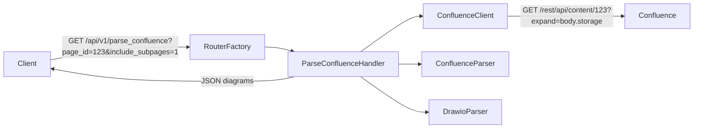

# Архитектура системы

## Назначение

Сервер предоставляет единый REST API для:

1. **Парсинга архитектурных диаграмм** — извлечение компонентов и связей из PlantUML (Sequence, C4) и DrawIO (C4). Результат — JSON: `components`, `requests`, `parent_child`.
2. **AI-обработки** — отправка текста в OpenAI-совместимый API (по умолчанию DeepSeek) и возврат ответа.
3. **Интеграции с Confluence** — загрузка страниц, рекурсивное раскрытие include-макросов, загрузка дерева подстраниц, извлечение встроенных PlantUML/DrawIO-диаграмм и DrawIO-вложений.
4. **Метрик и документации** — Prometheus-метрики и OpenAPI-спецификация (Swagger).

## Общая структура

```
poco_ai_server/
├── src/
│   ├── main.cpp                       # Точка входа, инициализация HTTP-сервера, метрик, логов
│   ├── handler/                       # HTTP-обработчики (наследуют HTTPRequestHandler)
│   │   ├── router_factory.h           # Маршрутизация URI+метод → обработчик
│   │   ├── request_counter.h          # Глобальные указатели на метрики (глобальные переменные)
│   │   ├── process_with_ai_handler.h
│   │   ├── parse_plantuml_sequence_handler.h
│   │   ├── parse_plantuml_c4_handler.h
│   │   ├── parse_drawio_handler.h
│   │   ├── load_confluence_handler.h
│   │   ├── parse_confluence_handler.h
│   │   ├── swagger_handler.h
│   │   ├── metrics_handler.h
│   │   └── not_found_handler.h
│   ├── plantuml/
│   │   ├── plantuml_sequence.h        # Парсер PlantUML Sequence
│   │   └── plantuml_c4.h              # Парсер PlantUML C4
│   ├── drawio/
│   │   └── drawio_parser.h            # Парсер DrawIO C4
│   ├── confluence/
│   │   ├── confluence_client.h        # REST-клиент Confluence + раскрытие include
│   │   └── confluence_parser.h        # Парсер storage-HTML → диаграммы
│   └── openai/
│       └── openai_client.h            # Клиент OpenAI/DeepSeek
├── test/
│   ├── parser_test.cpp                # Unit-тесты (Google Test)
│   └── fixtures/                      # Входные/ожидаемые данные для тестов
├── scripts/
│   └── json2dot.py                    # Конвертация JSON → DOT (Graphviz)
├── CMakeLists.txt                     # Сборка (C++17, POCO, zlib, Google Test)
├── Dockerfile / Dockerfile.test       # Образ для продакшена и для тестов
├── docker-compose.yaml
└── .env_example
```

## Ключевые компоненты

### 1. HTTP-сервер (`main.cpp`)

- Плагин приложения `ServerApp` от `Poco::Util::ServerApplication` (`POCO_SERVER_MAIN`).
- Конфигурирует корневой логгер по `LOG_LEVEL` (`trace…none`).
- Порт задаётся через `PORT` (по умолчанию `8080`).
- Создаёт глобальные метрики Prometheus (`http_requests_total`, `http_request_duration_seconds`, `http_errors_total`) в пространстве имён `handlers`.
- Запускает `HTTPServer` с `RouterFactory`; ожидает сигнал завершения (`waitForTerminationRequest`).

### 2. Маршрутизация (`router_factory.h`)

Сопоставление `URI + HTTP-метод` → обработчик. Сравнение точное (URI без учёта query-параметров, кроме GET-эндпоинтов Confluence, где query отделяется по `?`):

| URI | Метод | Обработчик |
|---|---|---|
| `/api/v1/process_with_ai` | POST | `ProcessWithAIHandler` |
| `/api/v1/parse_plantuml_sequence` | POST | `ParsePlantumlSequenceHandler` |
| `/api/v1/parse_plantuml_c4` | POST | `ParsePlantumlC4Handler` |
| `/api/v1/parse_drawio` | POST | `ParseDrawioHandler` |
| `/api/v1/load_confluence` (query `page_id`) | GET | `LoadConfluenceHandler` |
| `/api/v1/parse_confluence` (query `page_id`) | GET | `ParseConfluenceHandler` |
| `/swagger.yaml` | GET | `SwaggerHandler` |
| `/metrics` | GET | `MetricsHandler` |
| всё остальное | любой | `NotFoundHandler` (404) |

### 3. Общая логика HTTP-обработчиков

Все обработчики следуют единому шаблону:

1. Замер времени `Poco::Timestamp start` и инкремент счётчика `http_requests_total`.
2. Проверка HTTP-метода (иначе `405 Method not allowed`).
3. Чтение тела запроса через `Poco::StreamCopier::copyToString`.
4. Для POST — парсинг JSON (для `parse_*`) или валидация поля `text/prompt/message` (для AI).
5. Вызов «бизнес»-функции (парсер/клиент).
6. Формирование JSON-ответа; HTTP-статус `200` при `success:true`, `400` при `success:false`.
7. Инкремент `http_errors_total` для ошибок (4xx/5xx), запись в гистограмму `http_request_duration_seconds` и лог-строку `{status} {METHOD} {uri} from {ip}, {ms} ms`.

Обработчики POST-парсеров допускают как JSON-тело (`Content-Type: application/json`), так и **raw-текст** (XML или PlantUML прямо в теле). JSON-ключи для диаграмм: `text`, `plantuml`, `content` (PlantUML) / `text`, `xml`, `content`, `drawio` (DrawIO).

> ⚠️ Обработчики парсеров используют `std::regex`, поэтому при очень больших диаграммах возможен stack overflow. Для DrawIO извлечение root-узла специально сделано без regex (строковый поиск), чтобы избежать этой проблемы.

### 4. Парсеры (чистые функции, без I/O)

- `plantuml::PlantUmlSequenceParser::parse(text) -> JSON` — только Sequence-диаграммы.
- `plantuml::PlantUmlC4Parser::parse(text) -> JSON` — только C4 (rectangle и C4-PlantUML `Person/System/Rel`).
- `drawio::DrawioParser::parse(xml) -> JSON` — C4-диаграммы DrawIO (объекты `c4Type`, связи `Relationship`).

Все парсеры — статические методы, не зависят от сети/БД, что делает их легко тестируемыми. Подробно — в разделах «Алгоритмы».

### 5. Confluence-клиент (`confluence_client.h`)

HTTPS-клиент к REST API Confluence:
- **on-premises (Server/Data Center)** — REST API v1 под `/rest/api` (по умолчанию).
- **Cloud (Atlassian)** — REST API v2 под `/wiki/api/v2`.
- Авторизация: по умолчанию Bearer PAT (`Authorization: Bearer <CONFLUENCE_TOKEN>`); режим Basic (`user:token`) — при `CONFLUENCE_AUTH_TYPE=basic`.
- Поддержка контекстного пути (например, `https://host/confluence`).
- Рекурсивное раскрытие include-макросов, загрузка дерева подстраниц, поиск DrawIO-вложений.

### 6. Парсер HTML Confluence (`confluence_parser.h`)

Извлекает диаграммы из storage-HTML (`body.storage.value`):
- PlantUML-макросы (`ac:name="plantuml"`) — код из CDATA или `ac:plain-text-body`.
- DrawIO-макросы (`ac:name="drawio"`, `"draw.io"`, `"draw-io"`) — XML из CDATA/plain-text/вложенных тегов, либо признак вложения (attachment).
- Определение подтипа диаграммы (sequence/c4/component/usecase/uml/flowchart/architecture).
- `sectionTitle` — заголовок раздела (последний `<h2>`/`<h1>` перед диаграммой).

### 7. AI-клиент (`openai_client.h`)

- POST к `{OPENAI_API_URL}/v1/chat/completions` (или `/chat/completions` если базовый URL уже содержит `/v1`).
- Поля: `model`, `messages` (system-промпт + user).
- Заголовок `Authorization: Bearer <OPENAI_API_KEY>`.
- Парсинг ответа `choices[0].message.content`.

### 8. Асинхронный менеджер AI (`async_openai_manager.h`)

- `AsyncOpenAIManager` — синглтон: `std::unordered_map<int64_t, AsyncJob>` (id → задача) + `Poco::ThreadPool`.
- `AsyncJob`: `id`, `startTime` (время старта), `retries` (число перепосылов), `bytesSent` (байт отправлено в ИИ), `status` (`running`/`completed`/`failed`), `result`/`error`, `prompt`.
- `submit()` генерирует id, сохраняет задачу и ставит в пул; воркер вызывает `OpenAIClient::chatCompletion` с ретраями (`OPENAI_MAX_RETRIES`), обновляет `retries`/`bytesSent`/`status`.
- Старые завершённые задачи удаляются при превышении `OPENAI_ASYNC_MAX_JOBS`.
- Эндпоинты: `POST process_with_ai_async`, `GET async_ai_status`, `GET async_ai_result`.

## Поток запроса (пример `parse_confluence`)



Последовательность (для `include_subpages=1`):

1. `collectPageIdsWithDepth` — BFS по дереву подстраниц (защита от циклов через `seen`).
2. Для каждой страницы `getPageBodyWithIncludes` → HTML с раскрытыми include-макросами.
3. `appendDiagramsForPage` — извлечение диаграмм: regex-парсер (если включён), inline-код, DrawIO-вложения.
4. Глобальная дедупликация по хэшу `text + format`.
5. Ответ: `{diagrams: [...], count: N}`.

## Обработка ошибок

- Парсеры возвращают JSON с `"success": false` и полем `"error"`; обработчик проставляет HTTP-статус:
  - `200` — успех (`success: true`);
  - `400` — неверный вход (не диаграмма, пустое тело, неверный JSON);
  - `500` — внутренняя ошибка (непойманное исключение).
- Confluence/AI:
  - `503 Service Unavailable` — сервис не настроен (нет `CONFLUENCE_*` или `OPENAI_API_KEY`);
  - `502 Bad Gateway` — ошибка удалённого API;
  - `400` — отсутствует обязательный параметр `page_id`.
- Все ошибки логируются с уровнем `error` и учитываются в метрике `http_errors_total`.

## Масштабируемость и ограничения

- Однопоточный цикл событий POCO `HTTPServer` (по умолчанию использует `HTTPServerParams` без явной настройки пула потоков). Тяжёлые операции (загрузка больших страниц, многостраничное дерево) блокируют обработчик.
- Введены защитные лимиты (см. «Конфигурацию»): максимальный размер тела страницы для парсинга (`CONFLUENCE_PARSE_PAGE_MAX_BYTES`, по умолчанию 4 МБ), максимальный размер ответа/вложения, глубина и число узлов дерева, глубина и число include-макросов, размер расширенного тела.
- Дубликаты диаграмм исключаются глобальным хэшем (best-effort, возможны коллизии).
